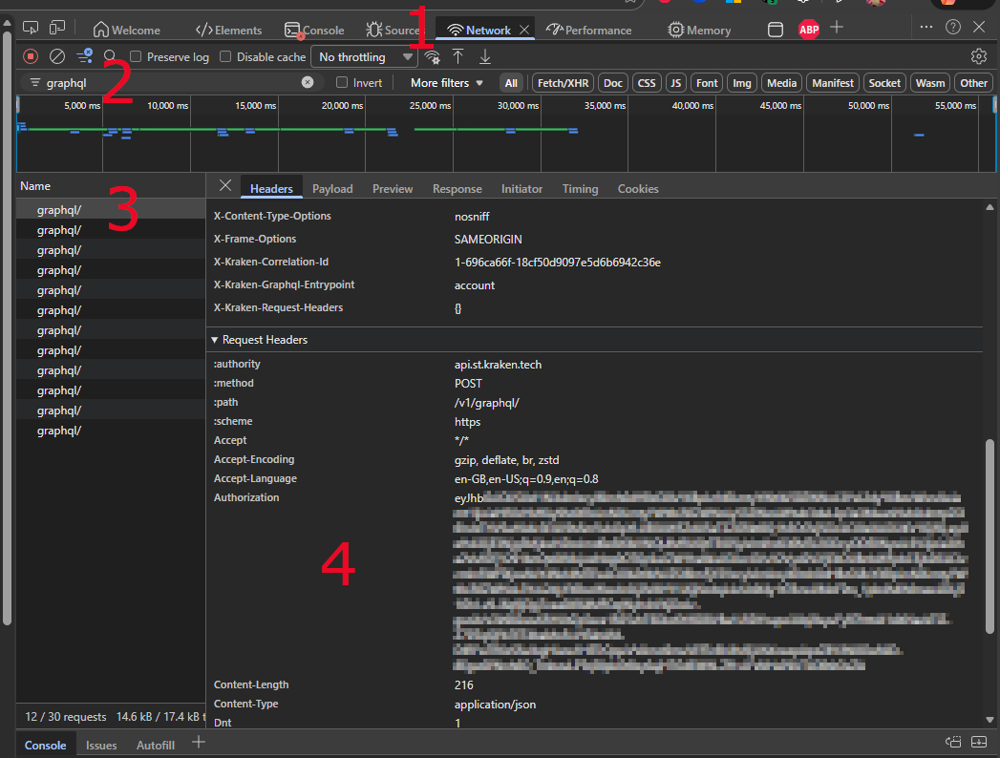

# Retrieving Your Authentication Token

This guide explains how to retrieve your Severn Trent authentication token using Chrome Developer Tools.

Once logged into your Severn Trent account on the web:

1. Open Chrome Dev Tools (press `F12`) and select the **Network** tab
2. In the filter box, type `graphql`
3. Select one of the `graphql/` entries from the list under **Name** and ensure that **Headers** is selected
4. Scroll down until you see the **Request Headers** section - there should be an **Authorization** entry that contains the token we require (starts with `eyJ`)

Copy this token into the integration setup page.

